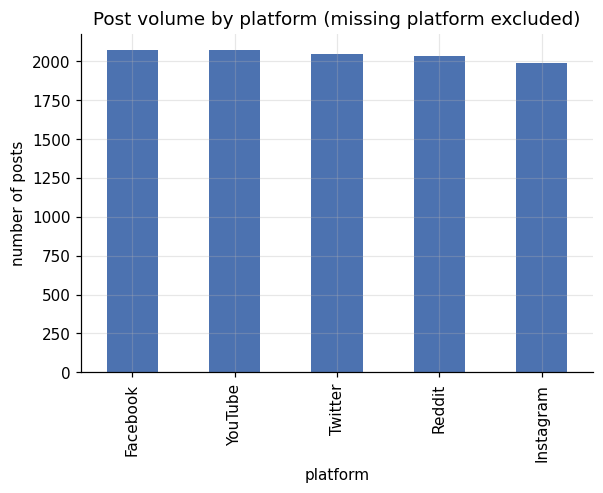
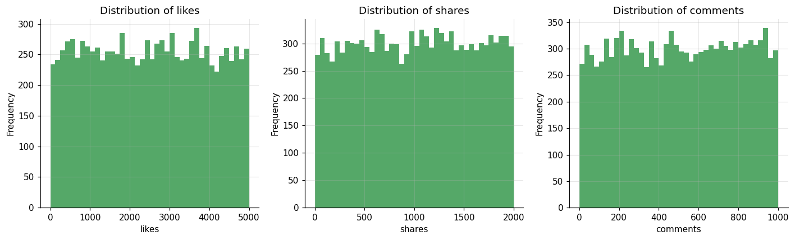
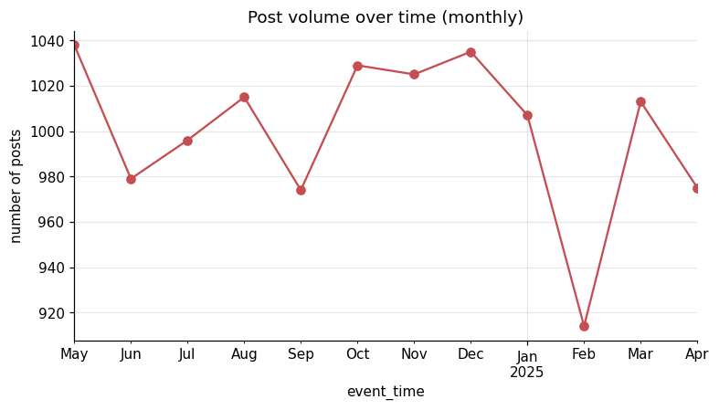
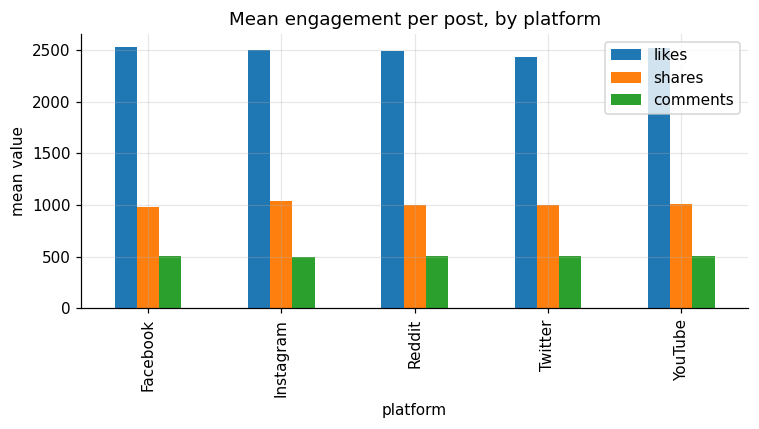
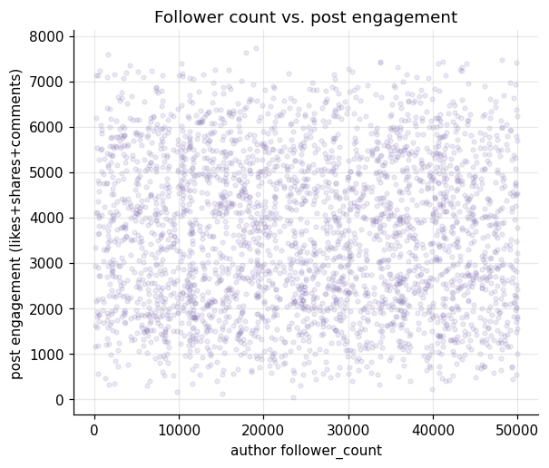
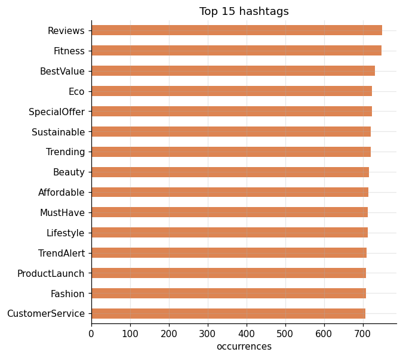

# DATA VORTEX — Rebuilding the Social Engine

A full audit → clean → validate → EDA → insight pipeline for a corrupted social-media
engagement dataset (1,500 users, 12,360 posts across 5 platforms).

Every number in this document is reproducible by running the scripts in `src/` in
order, or by re-executing `notebooks/DataVortex_Analysis.ipynb`. Nothing here was
hand-typed from memory — figures are pulled from `reports/*.md`, which are generated
fresh by the pipeline.

## Project structure

```
data/raw/          Original files, byte-for-byte untouched (checksum-verified)
data/cleaned/       users_cleaned.csv, posts_cleaned.csv
data/datavortex.db  SQLite database built from cleaned CSVs (Phase 2)
sql/                E3_platform_avg_engagement.sql, M1_location_engagement.sql, H2_rank_users_by_location.sql
src/                01_audit → 02_clean → 03_validate → 04_eda → 05_insights (Phase 1, + utils.py)
                    06_build_sql_database → 07_run_phase2_queries → 08_validate_phase2_results (Phase 2)
notebooks/          DataVortex_Analysis.ipynb — one reproducible run of the full pipeline
reports/            audit_report.md, cleaning_log.md, validation_report.md, insights.md
reports/figures/    8 PNG charts referenced below
reports/phase2/     E3_platform_avg_engagement.md, M1_location_engagement.md,
                    H2_rank_users_by_location.md, phase2_validation.md
README.md           this file
STATE.md            current status / what's done
```

## How to reproduce

```bash
cd datavortex
python3 src/01_audit_raw_data.py        # writes reports/audit_report.md
python3 src/02_clean_data.py            # writes data/cleaned/*.csv + reports/cleaning_log.md
python3 src/03_validate_cleaned_data.py # writes reports/validation_report.md, exits non-zero on failure
python3 src/04_eda_and_visuals.py       # writes reports/figures/*.png
python3 src/05_insights.py              # writes reports/insights.md
```

or open `notebooks/DataVortex_Analysis.ipynb` and run all cells — it calls the same
`src/` scripts, so the notebook and the standalone pipeline can never drift apart.

## 1. What was wrong with the raw data

The **users table** (1,500 rows) was clean: no missing values, no duplicate IDs, no
negative follower counts, no unparseable dates. It only needed whitespace trimming and
dtype casting.

The **posts table** (12,360 rows) had five distinct, quantified problems:

| Issue | Scale | Evidence |
|---|---|---|
| Exact duplicate rows | 360 rows (352 distinct `post_id`s, each appearing 2-3×) | Byte-identical across all 8 columns — re-ingestion, not conflicting data |
| Mixed timestamp formats | 3 formats in one column: ISO 8601 (40.0%), Unix epoch (30.6%), `DD-MM-YYYY` (29.3%) | 0 unparseable once classified |
| Missing `platform` | 1,846 rows (14.9%) | literal `NULL`/empty placeholders |
| Missing `text_content` | 1,770 rows (14.3%) | literal `NULL`/empty placeholders |
| Missing `likes` | 1,858 rows (15.0%) | literal `NULL`/empty placeholders |
| Negative `likes` | 525 of 10,502 non-missing values (5.0%) | `abs(negative)` mean=2457/std=1427 vs. positive mean=2495/std=1438 — same distribution, sign-flip |
| HTML entities in text | 341 posts (e.g. `&amp;`) | unescaped |

`shares` and `comments` had **zero** missing or negative values — corruption was
concentrated in exactly four fields. Full detail: `reports/audit_report.md`.

## 2. How it was cleaned (no fabricated values)

- **Duplicates**: dropped 360 exact-duplicate rows, keeping the first occurrence.
- **Missing values**: `NULL`/empty placeholders normalized to real NaN and **left as
  missing** — never imputed or guessed. Rows are kept; downstream analysis simply
  excludes the missing field where needed.
- **Timestamps**: all three formats parsed into one `event_time` column (ISO 8601). The
  original raw string is preserved in `timestamp_raw` for full traceability.
- **Negative likes**: corrected via `abs()`. This is a *correction*, not fabrication —
  the audit shows the negative values are the same underlying distribution as the
  positive ones, just sign-flipped, so taking the magnitude recovers the true value
  rather than inventing one.
- **Text**: HTML entities decoded (`&amp;` → `&`), whitespace trimmed. Wording and
  punctuation otherwise untouched.

Full line-by-line reasoning: `reports/cleaning_log.md`.

**Result:** 12,360 → 12,000 posts (360 exact duplicates removed), 1,500 users
unchanged. Row-level detail in `data/cleaned/`.

## 3. Validation

15/15 automated checks pass against the cleaned data (`reports/validation_report.md`),
including: no duplicate rows or IDs, no negative `likes`/`shares`/`comments`, 100% of
`user_id`s in posts resolve to a real user, no post is dated before its author's
account-creation date, and no leftover placeholder strings anywhere.

## 4. EDA highlights








Post volume is steady month over month (~1,000–1,070 posts/month, no seasonal
collapse), spread almost evenly across all 5 platforms, and hashtag usage is
concentrated in a handful of recurring campaign themes (#Reviews, #Fitness,
#BestValue, #SpecialOffer, #Eco each appear on 7.0-7.3% of texted posts).

## 5. Key insights — Rebuilding the Social Engine

Full write-up with every underlying number: `reports/insights.md`. Headlines:

1. **Follower count carries no engagement signal.** Correlation between author
   `follower_count` and total engagement is **r = -0.011**. The top 10% most-followed
   authors (≥44,363 followers) average the *same* engagement (3,587) as the bottom 10%
   (≤5,446 followers, 3,638 avg) — a >100× audience gap with a 1.4% engagement
   difference. **A rebuilt ranking/recommendation engine should not use follower count
   as a proxy for reach or influence.**

2. **Platform barely matters for engagement.** Mean engagement per post ranges only
   from 3,564 (Twitter) to 3,669 (Instagram) — a 3.0% spread. Platform-specific
   engagement models add little value here; effort is better spent on content-level
   features.

3. **The corruption itself is uniform, systemic noise — not one broken pipeline.**
   Negative-`likes` rate stays within 4.2%-6.4% across every month and 3.9%-5.9% across
   every platform; duplicate-row rate stays within 4.2%-6.7% month over month. A single
   faulty integration or bad deploy would spike in one slice and vanish elsewhere;
   instead every slice looks the same. **When rebuilding the ingestion layer, invest in
   a general field-level validation step, not a hunt for one bad connector.**

4. **~3% of posts contain self-contradictory sentiment language** (e.g. both "Absolutely
   loving it" and "Disappointed with the quality" in the same text). A naive
   keyword-based sentiment classifier would silently mis-score these. **A rebuilt
   sentiment layer needs to be phrase-order- or clause-aware.**

5. **Missing `platform` looks like a metadata gap, not a broken record.** Posts missing
   a platform tag have usable `likes` data 85.4% of the time — statistically the same
   rate as posts that do have a platform tag (84.8%). This points to a lookup/tagging
   failure on otherwise-healthy posts, worth a targeted backfill rather than discarding
   ~15% of the dataset.

## Data dictionary — `data/cleaned/posts_cleaned.csv`

| Column | Type | Notes |
|---|---|---|
| `post_id` | string | unique after dedup |
| `user_id` | string | foreign key into `users_cleaned.csv`, 100% resolvable |
| `platform` | string / NaN | one of Facebook/Instagram/Reddit/Twitter/YouTube, or missing |
| `text_content` | string / NaN | HTML-decoded, trimmed; missing where raw was placeholder |
| `timestamp_raw` | string | original raw value, preserved for traceability |
| `event_time` | datetime (ISO 8601) | standardized from 3 raw formats |
| `likes` | float / NaN | sign-corrected, missing preserved as NaN |
| `shares` | int | complete, non-negative |
| `comments` | int | complete, non-negative |

## Caveats and honest limitations

- `likes` remains missing for ~15% of posts (1,814 of 12,000) by design — it was never
  imputed, so any mean/aggregate involving `likes` is computed over the non-missing
  subset only (see each script for exact denominators used).
- The sentiment-phrase analysis in insight #4 uses a fixed keyword list, not a trained
  classifier — it demonstrates the *contradiction problem*, not a production sentiment
  score.
- Brand/product extraction was explored during EDA but is not part of the final cleaned
  schema; it would need a more robust template parser than the regex used for
  exploration to be submission-grade.

---

## Phase 2 — SQL Implementation

Phase 2 adds three SQL queries executed via Python `sqlite3` against `data/datavortex.db`,
built from the Phase 1 cleaned CSVs. Phase 1 (Python/pandas) is unchanged.

Global engagement definition: `COALESCE(likes, 0) + shares + comments`

### How to reproduce Phase 2

```bash
python src/06_build_sql_database.py     # builds data/datavortex.db
python src/07_run_phase2_queries.py     # runs E3, M1, H2; writes reports/phase2/*.md
python src/08_validate_phase2_results.py # 15/15 checks PASS; writes reports/phase2/phase2_validation.md
```

### E3 — Average Engagement by Platform

Query: `sql/E3_platform_avg_engagement.sql`  
Report: `reports/phase2/E3_platform_avg_engagement.md`

| platform | post_count | avg_likes | avg_shares | avg_comments | avg_total_engagement |
|---|---|---|---|---|---|
| Instagram | 1,989 | 2,500.93 | 1,040.84 | 499.80 | 3,669.38 |
| Reddit | 2,031 | 2,488.11 | 1,002.23 | 511.18 | 3,647.47 |
| YouTube | 2,073 | 2,517.77 | 1,011.83 | 504.38 | 3,638.03 |
| Facebook | 2,074 | 2,528.86 | 984.17 | 506.94 | 3,631.00 |
| Twitter | 2,049 | 2,437.69 | 1,005.39 | 506.13 | 3,563.75 |

NULL-platform rows (1,784) excluded. Spread between highest and lowest platform:
**~3.0%** — consistent with Phase 1 Insight #2 (platform is a weak differentiator).

### M1 — Which Locations Generate the Most Engagement

Query: `sql/M1_location_engagement.sql`  
Report: `reports/phase2/M1_location_engagement.md`

33 distinct locations, 12,000 total posts. Top 5:

| location | post_count | total_engagement | avg_per_post |
|---|---|---|---|
| Los Angeles, USA | 459 | 1,691,398 | 3,685.0 |
| Munich, Germany | 452 | 1,654,881 | 3,661.2 |
| Shanghai, China | 451 | 1,623,667 | 3,600.1 |
| Barcelona, Spain | 439 | 1,620,828 | 3,692.1 |
| Dubai, UAE | 421 | 1,532,010 | 3,639.0 |

### H2 — Rank Users Within Their Location

Query: `sql/H2_rank_users_by_location.sql`  
Report: `reports/phase2/H2_rank_users_by_location.md`

99 rows across 33 locations (top-3 per location via `RANK()`). No rank-3 ties found.
Users with zero posts are excluded by the INNER JOIN (none expected — 100% user_id resolution
confirmed in Phase 1 validation).

### Phase 2 Validation

15/15 independent pandas checks PASS. Full report: `reports/phase2/phase2_validation.md`.
