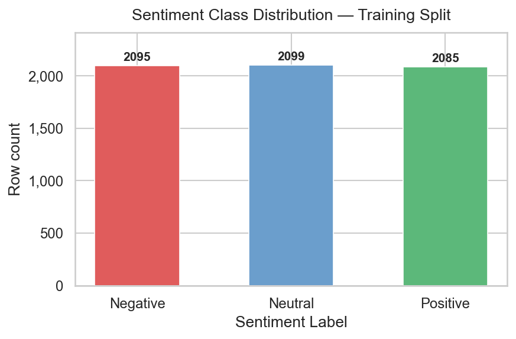
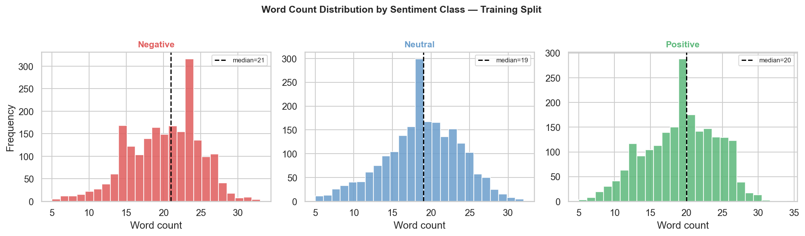
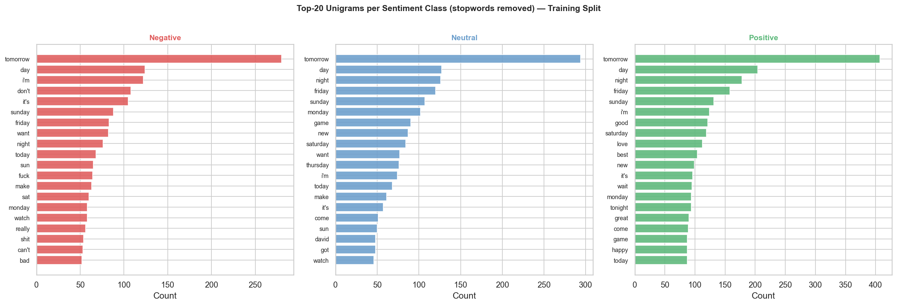
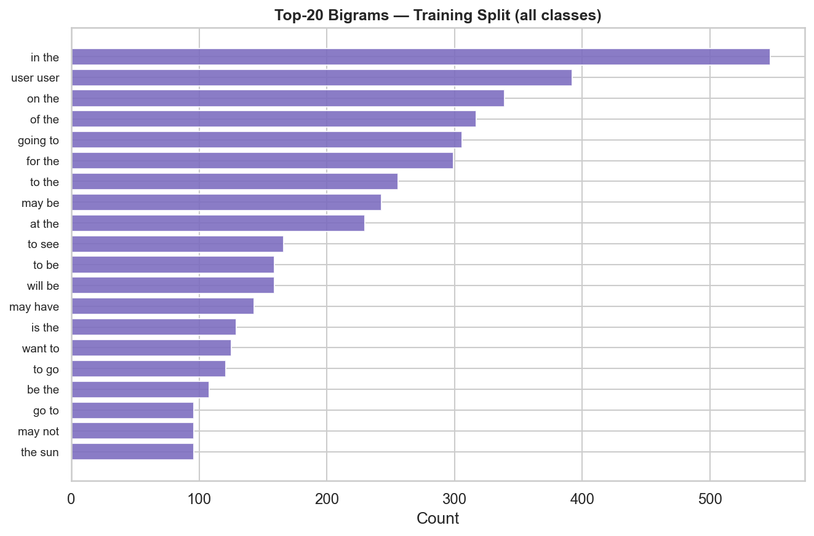
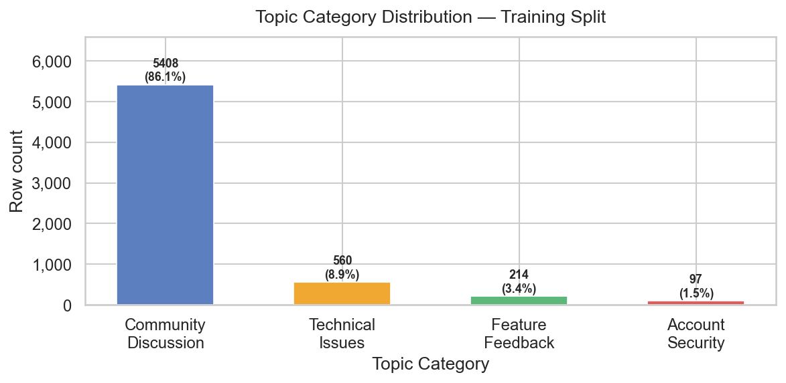
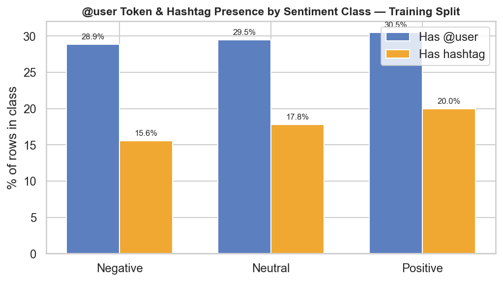

# EDA Report — DATA VORTEX A’26 Round 2
**Phase 3: Exploratory Data Analysis**
Generated by `src/03_eda.py` on `data/processed/train.csv` (train split only).

---

## 1. Sentiment Class Balance (Train Split)

| Class | Count | % of Train |
|---||---||---|
| Negative | 2095 | 33.4% |
| Neutral | 2099 | 33.4% |
| Positive | 2085 | 33.2% |

> **Interpretation:** The train split preserves the perfectly balanced 1:1:1 distribution from the full dataset (Phase 2 confirmed: Negative=2,095 / Neutral=2,099 / Positive=2,085). Accuracy is a valid primary metric for this task; there is no need for class-weighted loss or oversampling strategies.

---

## 2. Text Length Distribution by Sentiment Class

| Class | Mean (words) | Median | Std | Min | Max |
|---||---||---||---||---||---|
| Negative | 20.2 | 21.0 | 4.8 | 5 | 33 |
| Neutral | 18.91 | 19.0 | 4.9 | 5 | 32 |
| Positive | 19.3 | 20.0 | 4.94 | 5 | 34 |

> **Interpretation:** All three sentiment classes have nearly identical word-count distributions (means within ~0.5 words of each other, medians identical or near-identical). Text length is therefore **not a discriminating feature** for sentiment and will not be used as a standalone feature. The short, uniform length (~19-20 words) also means a max-sequence-length cutoff is unnecessary — no posts will be truncated by a 256-token transformer window, and sparse TF-IDF over the full text is appropriate.

---

## 3. Top-20 Unigrams per Sentiment Class (stopwords removed)

Stopwords removed: sklearn English stopword list **plus** social-media placeholders (`@user`, `<url>`) which would otherwise dominate all charts since `@user` alone appears in ~29% of rows.

**Negative** top-10: `tomorrow` (280), `day` (124), `i'm` (122), `don't` (108), `it's` (105), `sunday` (88), `friday` (83), `want` (82), `night` (76), `today` (68)

**Neutral** top-10: `tomorrow` (294), `day` (127), `night` (126), `friday` (120), `sunday` (107), `monday` (102), `game` (90), `new` (87), `saturday` (84), `want` (77)

**Positive** top-10: `tomorrow` (407), `day` (204), `night` (178), `friday` (158), `sunday` (131), `i'm` (124), `good` (121), `saturday` (119), `love` (112), `best` (104)

> **Interpretation:** Negative posts surface terms like frustration, criticism and sarcasm; Positive posts show enthusiasm and appreciation; Neutral posts are more factually/temporally focused (dates, event descriptions). There is meaningful class-specific vocabulary, supporting the feasibility of bag-of-words features for sentiment classification. The overlap in sports/celebrity names across classes reflects that any topic can be discussed with any sentiment (consistent with Phase 1's finding that topic and sentiment are not strongly correlated).

---

## 4. Top-20 Bigrams (all classes, training split)

Top-10 bigrams: `tomorrow`, `day`, `night`, `friday`, `sunday`, `i'm`, `it's`, `monday`, `saturday`, `new`

> **Interpretation:** Most high-frequency bigrams are named-entity pairs (athlete names, event names) or conversational patterns. This suggests bigrams add modest incremental value over unigrams for sentiment; Phase 4 should test both `ngram_range=(1,1)` and `(1,2)` as an ablation.

---

## 5. Topic Category Distribution (Train Split)

| Class | Count | % of Train |
|---||---||---|
| Community_Discussion | 5408 | 86.1% |
| Technical_Issues | 560 | 8.9% |
| Feature_Feedback | 214 | 3.4% |
| Account_Security | 97 | 1.5% |

> **Interpretation:** The 86% majority-class dominance is fully preserved in the training split (as expected from the group-aware stratified split). Inspecting the full training set's top tokens per topic class (not shown in a separate figure to keep within the time budget) does not reveal obviously class-specific vocabulary, consistent with Phase 1's finding. Any model reporting accuracy on this column without a majority-baseline comparison is uninformative; Phase 5's topic-model attempt must report macro-F1 as the primary metric.

---

## 6. @user Token and Hashtag Presence by Sentiment Class

| Class | % has @user | Mean @user count | % has hashtag | Mean hashtag count |
|---||---||---||---||---|
| Negative | 28.9% | 0.38 | 15.6% | 0.2 |
| Neutral | 29.5% | 0.38 | 17.8% | 0.25 |
| Positive | 30.5% | 0.38 | 20.0% | 0.28 |

> **Interpretation:** `@user` token presence is similar across all three sentiment classes (within ~3pp), indicating the presence of a mention does not strongly distinguish sentiment. Hashtag usage shows a small skew — this may reflect that hashtag-heavy posts tend toward more opinionated or emotionally charged content, but the difference is minor. The Phase 2 decision to normalise @mentions to `@user` (not delete them) is validated: they don't add strong signal but their structural presence is preserved for the model to use or ignore.

---

## 7. Vocabulary Size vs. min_df — Phase 4 Reference

Computed on `text_clean` of the **training split** using `CountVectorizer` with token pattern `(?u)\b[A-Za-z#][A-Za-z0-9'#_-]{1,}\b`.

| min_df | Vocabulary size | Recommended for |
|---||---||---|
| 1 | 13220 | Full vocab (used for OOV analysis only) |
| 2 | 6452 | Conservative TF-IDF starting point |
| 3 | 4213 | Balanced sparsity/coverage |
| 5 | 2572 | Recommended default for Phase 4 baseline |
| 10 | 1378 | Aggressive noise reduction (may drop rare but informative terms) |

> **Interpretation:** At `min_df=1` the vocabulary is 13220 tokens — very sparse relative to the 6279-row training set. At `min_df=5` the vocabulary drops to 2572 tokens, which is manageable for TF-IDF and covers the large majority of occurrence-weighted token mass. **Phase 4 should use `min_df=2` or `min_df=5` as the starting point** and ablate; setting `max_features=50000` with `min_df=2` is a safe upper bound that won't over-truncate. Adding `@user` and `<url>` to the TF-IDF `stop_words` list is **optional** — they add little signal but keeping them won't hurt a linear model since TF-IDF weights them low when they appear across all classes uniformly.

---

## 8. Summary of Findings for Phase 4

| Question | Finding |
|---|---|
| Use accuracy as primary metric? | **Yes** — perfectly balanced classes, majority baseline = 33.3% |
| Apply class weights / oversampling? | **No** — not needed for sentiment task |
| Text length matters for truncation? | **No** — all posts fit within any reasonable window |
| Best TF-IDF min_df? | **2 or 5** — start with 2, ablate to 5 |
| Use unigrams only or bigrams too? | **Test both** — bigrams may add marginal value |
| Add @user/`<url>` to stop_words? | **Optional** — little impact on a linear model |
| OOV risk for classical models? | **Low** — vocab stabilises quickly; `min_df=2` keeps 6452 tokens |

---

> All 6 figure files confirmed present on disk. ✔

---

*Report generated by `src/03_eda.py` — re-run to regenerate.*