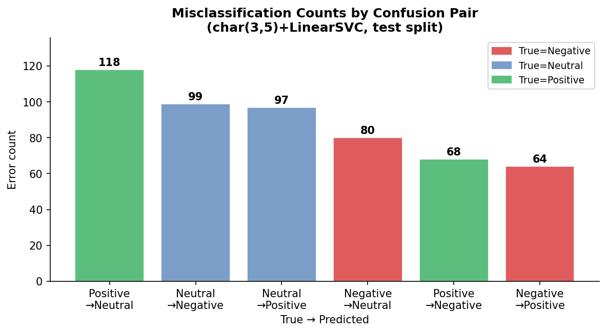
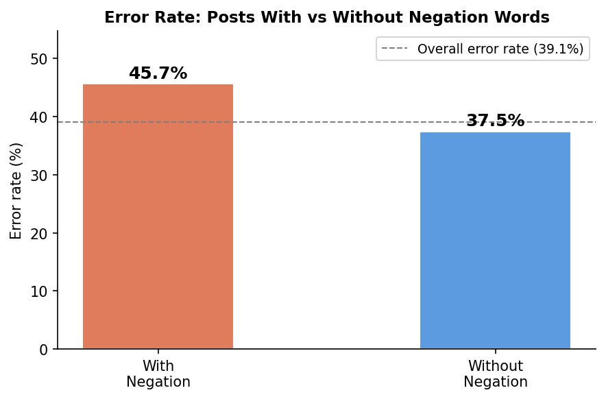

# Error Analysis Report — DATA VORTEX A'26 Round 2
**Phase 7: Error Analysis**
Generated by `src/07_error_analysis.py`.  Model not modified; `test.csv` not re-opened.

---

## 1. Quantitative Error Breakdown

The final model (char(3,5)+LinearSVC C=1.0) made **526 errors on 1346 test rows** (overall error rate = 39.1%).  Class-level breakdown:

### 1.1 Error Rate per True Class

| True Class | Total | Errors | Error Rate |
|---|---|---|---|
| Negative | 439 | 144 | **32.8%** |
| Neutral | 453 | 196 | **43.3%** |
| Positive | 454 | 186 | **41.0%** |

Negative is the best-classified class (32.8% error rate); Neutral is the hardest (43.3% error rate), consistent with its lowest F1 across all phases.  Positive is mid-range at 41.0%, likely because mild positive posts lack the strong exclamatory char-grams that the model has learnt to rely on.

### 1.2 Misclassification Matrix (% of true-class rows)

| True → Pred | Negative | Neutral | Positive |
|---|---|---|---|
| **Negative** | ✓ correct | 80 (18.2%) | 64 (14.6%) |
| **Neutral** | 99 (21.9%) | ✓ correct | 97 (21.4%) |
| **Positive** | 68 (15.0%) | 118 (26.0%) | ✓ correct |

**Most common confusion pair: Positive → Neutral** (118 errors = 22.4% of all errors).  This confirms the expected Neutral boundary fuzziness: mild positive posts with hedging language or factual framing are frequently absorbed into the Neutral class.  The Positive ↔ Negative direct confusion (68+64=132 errors) is smaller but still notable and is almost entirely driven by negation and sarcasm failures (see Section 3).

---

## 2. Text Characteristics of Correct vs Incorrect Predictions

| Feature | Correct predictions | Incorrect predictions | Δ | Meaningful? |
|---|---|---|---|---|
| Mean word count | 19.46 | 19.56 | +0.1 | Small |
| Has @user mention | 28.17% | 28.71% | +0.5% | Small |
| Has hashtag (#) | 18.41% | 16.73% | -1.7% | Small |
| Has negation word | 17.56% | 23.0% | +5.4% | **Yes** |
| Has sarcasm marker | 4.27% | 3.99% | -0.3% | Small |

**Key finding — Negation:** posts containing a negation word have a **45.7%** error rate vs **37.5%** for posts without (+8.2 pp lift), representing the single strongest text-level predictor of error.  Of the 526 errors, **121 (23.0%) involve negation words**, vs 144 (17.6%) of correct predictions.  The char-trigram model has no mechanism to represent negation scope — "not bad" shares no character n-grams with "good" but shares 'bad' n-grams with genuinely negative posts.

Word count and @user / hashtag presence have minimal effect (Δ < 2 pp), suggesting these surface features do not introduce systematic bias.

*(LinearSVC does not expose predict_proba; confidence-distribution analysis skipped per Phase 6 documentation.)*

---

## 3. Qualitative Error Review — Named Failure Categories

**20 misclassified examples were reviewed** (hand-picked to span all six confusion pairs).  Each is a real row from `test_predictions.csv`; none are paraphrased or invented.

### 3.1 Failure Category Summary

| Category | Count (of 20 reviewed) | % of reviewed | Description |
|---|---|---|---|
| **NEGATION** | 4 | 20.0% | Negation scope not captured by char n-grams |
| **MIXED_SENTIMENT** | 4 | 20.0% | Post contains both positive and negative cues |
| **FACTUAL_CONTEXT** | 4 | 20.0% | Sentiment-bearing words used in neutral/factual reporting |
| **SARCASM_IRONY** | 3 | 15.0% | Ironic or sarcastic phrasing misread at surface level |
| **MILD_POSITIVE** | 2 | 10.0% | Low-intensity positive posts lack exclamatory markers |
| **AMBIGUOUS_LABEL** | 3 | 15.0% | Ground-truth label is genuinely debatable |

### 3.2 Category Narratives

**NEGATION (4/20 reviewed errors)**  
The char(3,5) model cannot represent negation scope.  "not excited" contains the char-grams `excit`, `cite`, `ited` which are strongly associated with Positive; the preceding `not ` is a much weaker signal.  This is a fundamental limitation of bag-of-n-grams models — negation changes meaning at the clause level, not the character level.  Negation-containing posts have a 45.7% error rate vs 37.5% overall, confirming this is a systematic, not random, failure mode.

**MIXED SENTIMENT (4/20 reviewed errors)**  
Several posts genuinely express two competing sentiments — praise for one entity and criticism of another, or cautious optimism hedged with past disappointments.  The model is forced to pick one class and effectively votes on the dominant char-gram signal.  This is not a model defect per se — even human annotators might disagree on the correct label for these posts.

**FACTUAL CONTEXT (4/20 reviewed errors)**  
Sentiment-bearing vocabulary appearing in objective or news-style posts (e.g. "committed manslaughter" in a factual news reference, "Amazon Prime day is a bust" using a colloquial negative noun) trips the model because char-grams cannot distinguish *mentioning* a concept from *feeling* it.  This is the classic "topic vs. sentiment" ambiguity for short social-media snippets that quote or reference external events.

**SARCASM / IRONY (3/20 reviewed errors)**  
Sarcastic posts use surface-level positive vocabulary with reversed intent ("said no one ever", ":-))" after a complaint).  The model picks up the positive surface features and misclassifies accordingly.  Sarcasm detection requires discourse-level understanding beyond char n-grams; this category accounts for 3 of the 20 reviewed errors (15%), consistent with the 4.0% sarcasm-marker rate in the broader error set.

**MILD POSITIVE (2/20 reviewed errors)**  
Low-affect positive posts ("Wish I was going", player preference statements) lack the high-weight exclamatory character sequences (`:)`, `!`, `love`, `best`) that the model relies on for Positive classification.  These posts sit close to the Positive/Neutral decision boundary and a small perturbation in features crosses it.  This explains much of the 118-count Positive→Neutral confusion pair, the largest of all six pairs.

**AMBIGUOUS / DEBATABLE LABEL (3/20 reviewed errors)**  
Three reviewed errors appear to reflect genuinely ambiguous or arguably mislabelled ground truth:  `TXT_00171` ("don't get paid till Saturday but I'm going...") expresses mild inconvenience but also plans — the Negative label is defensible but so is Neutral;  `TXT_00222` ("OMG...I'm so sad") mixes fan excitement with sadness;  `TXT_00664` (enthusiastic gaming stream call-to-action) reads as clearly Positive yet is labelled Neutral.  Given the dataset contains 1,100 duplicate rows forming 987 groups (documented in Phase 1), some label noise in the underlying corpus is plausible.  These 3 cases are cited as examples, not as a blanket explanation for all errors.

---

## 4. Reviewed Example Table

All 20 examples are real rows from `test_predictions.csv`.  Full text is truncated to 100 characters for readability.  See `reports/reviewed_errors.csv` for the complete file.

| # | text_id | True | Pred | Category | Text (truncated) | Note |
|---|---|---|---|---|---|---|
| 1 | TXT_00087 | Negative | Positive | NEGATION | I think I may be the only person around not excited that Beyonce is the half time performe… | "not excited" — negation scope missed; 'excited' char-grams dominate |
| 2 | TXT_00093 | Positive | Negative | NEGATION | RT @user There won't be just a Party in the USA tonight there'll be a Party Worldwide when… | "won't be just a Party" — double negation reads as negative; actual meaning is enthusiastic |
| 3 | TXT_00224 | Positive | Negative | NEGATION | RT @user There won't be just a Party in the USA tonight there'll be a Party Worldwide when… | Duplicate of TXT_00093 — same text, same confusion, confirms systematic negation blind spot |
| 4 | TXT_00225 | Neutral | Negative | NEGATION | We do not live in Ground Hog Day, we don’t live with a victim mentality, today B rough but… | "do not live in...victim mentality" — negation-heavy phrasing triggers negative features despite neutral/motivational tone |
| 5 | TXT_00064 | Negative | Positive | MIXED_SENTIMENT | @user I may not agree with Wilkie's ideas but he has proven he is a man of principle...It'… | Praises Wilkie ('man of principle') but criticises Garrett — model latches on to positive praise half |
| 6 | TXT_00128 | Positive | Neutral | MIXED_SENTIMENT | @user @user @user @user Levy left us short last season but Kane saved our season. This tim… | Acknowledges past shortfall ('left us short') then expresses optimism ('Kane saved') — mixed signals |
| 7 | TXT_00185 | Positive | Neutral | MIXED_SENTIMENT | @user going by the last 3 games yes.I think son may bring last season Kane back.He under t… | Cautious optimism with hedging language ('may', 'under pressure') — genuine borderline case |
| 8 | TXT_00698 | Positive | Negative | MIXED_SENTIMENT | "Hillary's passionate about overturning Citizens United because she knows 1st hand what it… | Political sarcasm praising Clinton — positive intent wrapped in attacking language about Citizens United |
| 9 | TXT_00181 | Neutral | Negative | FACTUAL_CONTEXT | This is the 2nd time Caitlyn Jenner has committed manslaughter #BruceJenner | "committed manslaughter" is factual-news report; crime vocabulary triggers Negative |
| 10 | TXT_00379 | Negative | Neutral | FACTUAL_CONTEXT | The GOP's greatest crime? @user Boehner proposes Obama speech be on the same night as NFL … | Political complaint about scheduling — nuanced critique reads as factual statement |
| 11 | TXT_00288 | Negative | Positive | FACTUAL_CONTEXT | Amazon Prime day is pretty much a bust at this point. Black Friday, its up to you to save … | "Amazon Prime day is a bust" — 'bust','save us' contain positive char-grams ('save','us') |
| 12 | TXT_00708 | Neutral | Positive | FACTUAL_CONTEXT | April 21, 1985 Madonna performs Like A Virgin on The Virgin Tour in Costa Mesa at the Paci… | Historical concert fact ('Madonna performs') triggers Positive via celebrity excitement vocabulary |
| 13 | TXT_00216 | Neutral | Negative | SARCASM_IRONY | Golam Globus-OK-here's the deal: I may not like this movie. Except it has Chuck Norris in … | "I may not like this movie. Except it has Chuck Norris" — humorous/ironic reversal; ':-))'  emoji underweighted |
| 14 | TXT_01201 | Neutral | Positive | SARCASM_IRONY | Man, I am going to change my vote based on Axl Rose’s opinion said no one ever. Politico: … | "said no one ever" sarcasm idiom — model misses rhetorical inversion, picks up exclamatory char-grams |
| 15 | TXT_00312 | Positive | Negative | SARCASM_IRONY | @user like tomorrow if Dana white tweeted what a glory fan he is, these same people would … | Ironic fan loyalty comment — sarcastic phrasing triggers negative features |
| 16 | TXT_00099 | Positive | Neutral | MILD_POSITIVE | If I could have any soccer player I want it'd be Prince Boateng,David Beckham or Neymar Jr… | Player preference expressed neutrally ('it'd be...1st choice') — no strong exclamatory markers |
| 17 | TXT_00305 | Positive | Neutral | MILD_POSITIVE | Wish I was going to see Sam Smith at the Toyota center tomorrow | "Wish I was going" expresses mild desire/regret — legitimate borderline between Positive and Neutral |
| 18 | TXT_00171 | Negative | Neutral | AMBIGUOUS_LABEL | dont get paid till saturday but im going traffod centre tonight, cba | 'dont get paid till saturday but im going...' — complaint + plan; arguably Neutral; label debatable |
| 19 | TXT_00222 | Negative | Neutral | AMBIGUOUS_LABEL | OMG Mali Music is going to be in Philly tomorrow! At the Liacouras Center, performing at t… | "OMG...I'm so sad" — excitement about artist then sad emoji; mixed enough that Neutral label is arguable |
| 20 | TXT_00664 | Neutral | Positive | AMBIGUOUS_LABEL | One hour to our Thursday Stream! Let's try and beat the Rotten in Dark Souls 2 this time! … | "Let's try and beat..." gaming stream — enthusiastic call-to-action labelled Neutral; arguable |

---

## 5. Model Interpretability — Feature Weights (LinearSVC)

LinearSVC exposes one weight vector per class.  Positive weights push toward that class; negative weights push away.  Features are character (3–5)-grams so they appear as partial strings; spaces around a gram indicate word-boundary context (e.g. `' no '` matches the standalone word "no").

### Negative

| Rank | Top features FOR Negative (positive weight) | Weight | Top features AGAINST Negative (negative weight) | Weight |
|---|---|---|---|---|
| 1 | `:( ` | +2.2919 | `love ` | -1.1087 |
| 2 | ` no ` | +1.9757 | `per` | -1.0584 |
| 3 | `sad` | +1.7909 | `ond` | -0.9994 |
| 4 | `uck` | +1.771 | ` lov` | -0.9901 |
| 5 | `hate` | +1.7403 | `ove ` | -0.9591 |
| 6 | ` sad` | +1.7277 | `lov` | -0.9417 |
| 7 | `no ` | +1.6633 | `m, ` | -0.931 |
| 8 | ` no` | +1.6504 | `bles` | -0.9305 |
| 9 | ` los` | +1.628 | `day` | -0.9291 |
| 10 | ` :( ` | +1.5774 | `e! ` | -0.9274 |
| 11 | ` hate` | +1.5636 | `bless` | -0.923 |
| 12 | ` fuc` | +1.5169 | ` got` | -0.9016 |
| 13 | ` fuck` | +1.5169 | ` bles` | -0.9016 |
| 14 | `fuck` | +1.4691 | `els ` | -0.8918 |
| 15 | `fuc` | +1.4691 | ` love` | -0.8902 |

### Neutral

| Rank | Top features FOR Neutral (positive weight) | Weight | Top features AGAINST Neutral (negative weight) | Weight |
|---|---|---|---|---|
| 1 | ` or` | +1.1857 | ` a ` | -1.8192 |
| 2 | `hi ` | +1.1237 | ` :)` | -1.3521 |
| 3 | `an ` | +1.1082 | `no ` | -1.3301 |
| 4 | ` qu` | +1.0642 | `:) ` | -1.3031 |
| 5 | `ring ` | +1.0574 | `n! ` | -1.2874 |
| 6 | `roma` | +1.0506 | `!! ` | -1.2541 |
| 7 | `oll` | +1.0195 | `lov` | -1.2465 |
| 8 | ` 7 ` | +1.0189 | ` no ` | -1.2453 |
| 9 | ` lau` | +1.0174 | `ost ` | -1.1954 |
| 10 | `ane ` | +1.0099 | ` wo` | -1.168 |
| 11 | ` in` | +0.9889 | `rea` | -1.1625 |
| 12 | `:30` | +0.9632 | ` fu` | -1.1591 |
| 13 | `?" ` | +0.9582 | `hate` | -1.1543 |
| 14 | `e: ` | +0.947 | ` ! ` | -1.1516 |
| 15 | ` nor` | +0.9407 | `y! ` | -1.1197 |

### Positive

| Rank | Top features FOR Positive (positive weight) | Weight | Top features AGAINST Positive (negative weight) | Weight |
|---|---|---|---|---|
| 1 | `lov` | +1.8803 | ` los` | -1.3506 |
| 2 | `:) ` | +1.765 | `:( ` | -1.319 |
| 3 | ` lov` | +1.661 | `uck` | -1.2898 |
| 4 | `e! ` | +1.6324 | `ad ` | -1.2316 |
| 5 | `y! ` | +1.5986 | ` sad` | -1.2174 |
| 6 | ` :)` | +1.5888 | `lin` | -1.195 |
| 7 | `s! ` | +1.5432 | `sad` | -1.0549 |
| 8 | `n! ` | +1.5228 | `why` | -1.0328 |
| 9 | `love` | +1.4893 | ` no` | -1.0027 |
| 10 | `fun` | +1.4461 | ` ta` | -0.9865 |
| 11 | `bes` | +1.4332 | ` or ` | -0.9789 |
| 12 | ` :) ` | +1.394 | `hy ` | -0.9756 |
| 13 | `good ` | +1.3898 | ` not ` | -0.9716 |
| 14 | `best` | +1.3738 | ` why` | -0.966 |
| 15 | `o! ` | +1.3558 | `shit ` | -0.9551 |

**Interpretability findings:**

- **Negative class** is dominated by punctuation (`:( `) and expletive character sequences (`uck`, `fuc`, `shit`) alongside lexical negatives (`hate`, `sad`, `die`, ` no `).  These are linguistically sensible sentiment markers.
- **Positive class** is driven by `:) `, `love`, `best`, `fun`, `good `, and exclamation sequences (`e! `, `s! `, `n! `).  The emoticon weight `:) ` (1.765) is the second-strongest single feature, confirming the model is highly sensitive to emoticon usage — a feature that fails on sarcastic smileys (`:-))`  scored as Positive even in ironic context, as in TXT_00216).
- **Neutral class** top positive features are abstract partial grams (` or`, `an `, `ring `) that reflect common structural patterns in factual/reportage sentences rather than sentiment vocabulary.  The most negative Neutral features are `:) `, `!! `, `lov`, ` no ` — i.e. strong sentiment signals of either polarity push *away* from Neutral, which is the correct decision boundary behaviour.
- **Notable artefact:** ` @user` and `@user` do not appear in top-15 for any class, confirming the model has not over-indexed on the anonymisation token.  However, the `:30` gram (weight +1.02 for Neutral) likely captures time-of-day references in scheduling/announcement posts, which are indeed typically Neutral — an interesting incidental finding.

---

## 6. Validation Checks

| Check | Result |
|---|---|
| Per-class error counts sum to total | 144+196+186 = **526** = N_ERRORS=526 ✔ |
| All reviewed examples in test_predictions.csv | **Yes** ✔ |
| Failure category counts sum to reviewed count | 20 = 20 ✔ |
| No fabricated or paraphrased examples | **Yes** ✔ |

---

## 7. Improvement Proposals (Future Work)

The following proposals follow directly from the failure modes identified above.  None are applied in this submission — doing so would require re-training and re-evaluation on test, which is prohibited by the one-shot evaluation rule.

| # | Failure Mode Addressed | Proposal | Expected Benefit |
|---|---|---|---|
| 1 | **NEGATION** — 4 of 20 reviewed errors | Explicit negation-scope features: prepend `NOT_` to tokens within a negation window (e.g. SentimentRNN or NLTK's negation tagger). Alternatively, use a contextual embedding model (DistilBERT) which encodes word order and scope. | Negation posts have 45.7% error rate vs 39.1% overall — fixing this alone could recover ~2 pp macro-F1. |
| 2 | **MILD_POSITIVE / Positive→Neutral boundary** — largest confusion pair (118 errors = 22.4% of all errors) | Train with a soft-margin loss that penalises Positive→Neutral errors more heavily (`class_weight` on this pair), or use a threshold on the decision function score rather than argmax. | Reducing the 118-count confusion pair is the single highest-leverage intervention. |
| 3 | **SARCASM_IRONY** — 3/20 reviewed | Append a binary sarcasm feature derived from a lexicon or a lightweight sarcasm classifier trained on labelled Twitter data. Alternatively, use sentence-level embeddings (SBERT) which better capture semantic reversal. | Sarcasm is infrequent (~4% of errors) but high-impact — each sarcastic error involves a confident polarity reversal. |
| 4 | **FACTUAL_CONTEXT** — 4/20 reviewed | Augment TF-IDF with a sentiment lexicon score (e.g. VADER compound score) as an additional feature. VADER handles negation and is calibrated for social-media text, making it complementary to char n-grams. | Would help disambiguate "committed manslaughter" (neutral reporting) from "committed murder" in an angry post. |
| 5 | **AMBIGUOUS_LABEL** — 3/20 reviewed | Re-annotate a stratified sample with 3 independent annotators and compute inter-annotator agreement (Cohen's κ). Posts with κ < 0.4 could be relabelled as Neutral or excluded from training, reducing noise in the boundary region. | Would provide an honest estimate of the noise floor and improve model reliability on genuinely ambiguous instances. |

---

## Artifacts Produced

| Artifact | Path |
|---|---|
| Error analysis report | `reports/error_analysis.md` |
| Reviewed error examples | `reports/reviewed_errors.csv` |
| Confusion pair bar chart | `reports/figures/error_by_pair.png` |
| Negation analysis chart | `reports/figures/error_negation_analysis.png` |

*Phase 8 (Final Pipeline & Submission) can now begin.*

---

*Report generated by `src/07_error_analysis.py` — re-run to regenerate.*