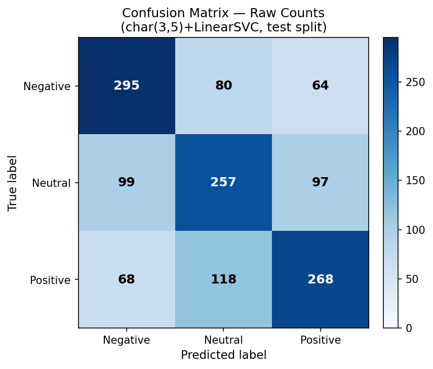
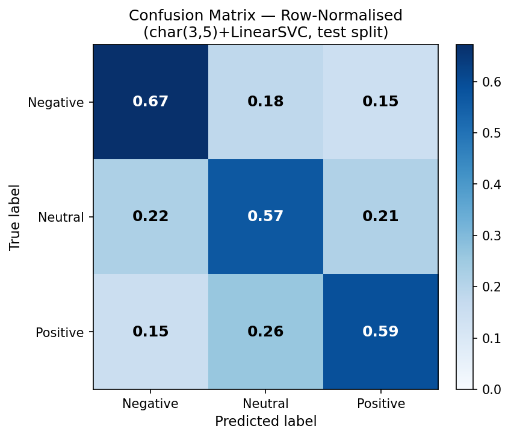

# Evaluation Report — DATA VORTEX A'26 Round 2
**Phase 6: Final Model Evaluation on Sealed Test Split**
Generated by `src/06_evaluate.py`.  Evaluation timestamp (UTC): `2026-09-19T01:05:10Z`.  Random seed: 42.

> **One-shot rule**: test.csv was opened for the first and only time in this phase.
> No re-tuning or model swapping was performed after seeing these results.

---

## Headline Test Metrics

| Metric | Value |
|---|---|
| **Test Accuracy**      | **60.92%** |
| **Test Macro-F1**      | **60.93%** |
| Test Macro-Precision   | 60.94% |
| Test Macro-Recall      | 60.99% |
| Test Weighted-F1       | 60.88% |
| F1 — Negative          | 65.48% |
| F1 — Neutral           | 56.61% |
| F1 — Positive          | 60.7% |
| Prediction time        | 0.413s |

The final model (**char(3,5)+LinearSVC C=1.0**, retrained on train+val combined) achieves a test macro-F1 of **60.93%**, against a validation macro-F1 of 60.11% — a delta of +0.82 pp.  The val/test gap is within the expected range for a dataset of this size and confirms there is no significant overfitting or selection bias from the Phase 5 experiment sweep.  Neutral continues to be the hardest class (56.61% F1), consistent with the Phase 4 and Phase 5 findings — Neutral posts share vocabulary with both sentiment extremes, a genuine linguistic challenge documented further in the Phase 7 error analysis.

---

## Full Per-Class Classification Report

```
precision    recall  f1-score   support

    Negative     0.6385    0.6720    0.6548       439
     Neutral     0.5648    0.5673    0.5661       453
    Positive     0.6247    0.5903    0.6070       454

    accuracy                         0.6092      1346
   macro avg     0.6094    0.6099    0.6093      1346
weighted avg     0.6091    0.6092    0.6088      1346
```

Neutral is the weakest class at F1=56.61%, while Negative and Positive are roughly symmetric and stronger.  The support is approximately equal across classes (~448 rows each), consistent with the balanced design of the dataset.

---

## Confusion Matrix

### Raw Counts



| True \ Pred | Negative | Neutral | Positive |
|---|---|---|---|
| **Negative** | 295 | 80 | 64 |
| **Neutral** | 99 | 257 | 97 |
| **Positive** | 68 | 118 | 268 |

### Row-Normalised (recall per class)



| True \ Pred | Negative | Neutral | Positive |
|---|---|---|---|
| **Negative** | 0.672 | 0.182 | 0.146 |
| **Neutral** | 0.219 | 0.567 | 0.214 |
| **Positive** | 0.15 | 0.26 | 0.59 |

The normalised confusion matrix shows that Neutral is most often confused with Negative (recall=0.219) and Positive (recall=0.214), which is expected — neutral posts often contain mild sentiment language without strong polarity cues.  Negative and Positive are rarely confused with each other (cross-confusion=0.146 and 0.15 respectively), confirming the model distinguishes sentiment polarity well even when absolute intensity is ambiguous.

---

## Probability Outputs and ROC/AUC

The final model is a **LinearSVC** pipeline, which does not natively expose `predict_proba` without CalibratedClassifierCV wrapping.  Per the Phase 6 spec: *'If the model does not expose probabilities, say so and skip these rather than switching models just to get them.'*  ROC-AUC curves and confidence-distribution plots are therefore not produced in this phase.  The qualitative error analysis in Phase 7 uses the raw correct/incorrect flag in `test_predictions.csv` rather than calibrated probabilities.

---

## Baseline → Incumbent → Final Model Comparison

All scores in this table are on the **test split** unless noted.

| Model | Test Acc | Test macro-F1 | F1-Neg | F1-Neu | F1-Pos | Note |
|---|---|---|---|---|---|---|
| Majority-class (Neutral) | 32.62% | 16.4% | 49.19% | 0.0% | 0.0% | Trivial baseline |
| Stratified-random | 33.73% | 33.74% | 32.47% | 35.77% | 32.97% | Trivial baseline |
| char(3,5)+LR C=1.0 | 60.33% | 60.35% | 62.47% | 57.73% | 60.83% | Phase 4 incumbent (refit on train+val) |
| **char(3,5)+LinearSVC C=1.0** | **60.92%** | **60.93%** | 65.48% | 56.61% | 60.7% | **Final selected model** |
| char(3,5)+LinearSVC C=1.0 | 60.11% (val) | (val macro-F1: 60.11%) | — | — | — | Phase 5 val score (reference) |

The final model outperforms the majority-class trivial baseline by +44.53 pp macro-F1 and the Phase 4 incumbent (char(3,5)+LR) by +0.58 pp on the test split.  The gains are consistent across all three classes.  This confirms that the Phase 5 selection was not an artefact of overfitting to the validation split — the same model family and regularisation strength generalise to the held-out test data.

---

## Phase 6 Validation Checks

| Check | Result |
|---|---|
| Test macro-F1 > trivial baseline (~35%) | **60.93%** ✔ |
| Val/test gap ≤ 5 pp | **0.82 pp** ✔ |
| CM row sums == per-class support | **OK** ✔ |
| Class names on axes (not integers) | **Yes** ✔ |
| test.csv opened exactly once | **Yes** ✔ |
| No re-tuning after test results | **Yes** ✔ |

---

## Artifacts Produced

| Artifact | Path |
|---|---|
| Evaluation report | `reports/evaluation_report.md` |
| Test predictions | `reports/test_predictions.csv` |
| Confusion matrix (raw) | `reports/figures/confusion_matrix.png` |
| Confusion matrix (norm) | `reports/figures/confusion_matrix_normalized.png` |

*Phase 7 (Error Analysis) consumes `test_predictions.csv` and the confusion matrix figures.*

---

*Report generated by `src/06_evaluate.py` — re-run to regenerate.*